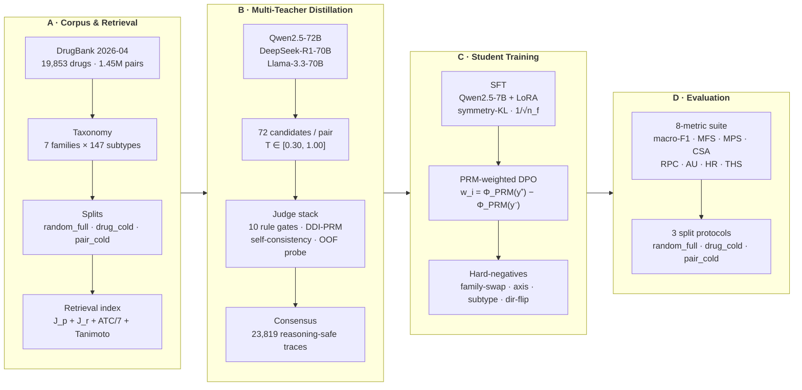

<div align="center">

# CoT&#8209;DDI

### Mirror-Augmented Reasoning Distillation with PRM-Weighted Preference Optimization for Drug–Drug Interaction Mechanism Prediction

<br>

<p>
  <a href="#"></a>
  <a href="#"></a>
  <a href="#"></a>
  <a href="#"></a>
  <a href="#"></a>
  <a href="LICENSE"></a>
  <a href="#"></a>
</p>

<sub>A 7B reasoner that explains the <em>mechanism</em>, not just the label — and stays consistent when you flip the pair.</sub>

</div>

<br>

> **TL;DR** &nbsp; Three frontier teachers generate 72 candidate traces per drug pair. A fine-tuned **DDI-PRM critic** + 10 rule gates merge them into one consensus trace. A 7B Qwen student is then trained with a **position-restricted symmetry-KL** loss (mirror-AB↔BA agreement) and **PRM-weighted DPO** with four families of programmatic hard-negatives. Result: macro-F1 **0.797**, MFS **0.954**, MPS **0.892**, HR **0.0005** on the in-distribution validation set — with the **first explicit retrieval-ablation** in the DDI literature (removing the neighbour block collapses macro-F1 from 0.797 → 0.178 on the same checkpoint).

<br>

## Pipeline



<br>

## Why this exists

Most DDI benchmarks score **one number** — the top-1 label of a feature or graph classifier. In the clinic that is not enough. A pharmacist needs the **mechanism** (which CYP, transporter, or PD axis), the **direction** (A→B, B→A, bidirectional, or none), the **evidence**, and a calibrated **abstention** when the evidence is thin.

Three failure modes block naive teacher-to-student distillation:

| Failure | What it looks like | How we fix it |
|---|---|---|
| **Mirror inconsistency** | The same pair flipped AB↔BA gets different family/direction in 51.4 % of V3 cases | Co-batched AB & BA + position-restricted symmetry-KL on the direction tag |
| **Class imbalance** | 47× ratio between families collapses the student onto `AdverseRisk` | Class-balanced 1/√n<sub>f</sub> sampling + family-axis hard-negatives |
| **Reasoning decay** | Student parrots teacher phrasing and cites phantom evidence | DDI-PRM step critic + 10 rule QC gates + reasoning-safety filter |

<br>

## Repository layout

```
CoT_DDI/
├── configs/                       YAML configs for every phase
│   ├── base.yaml                  paths · splits · models · loss weights · GO/NO-GO thresholds
│   ├── prm_rubric.yaml            step-level rubric for the DDI-PRM
│   └── accelerate_fsdp*.yaml      FSDP / mixed-precision per training stage
│
├── src/
│   ├── data/                      Phase A — corpus construction
│   │   ├── parse_drugbank.py            XML → parquet (drugs, pairs, pathways, x-refs, brands)
│   │   ├── fetch_pathways.py            KEGG + SMPDB pathway harvest
│   │   ├── build_pk_table.py            CYP / P-gp / OATP / BCRP flags per drug
│   │   ├── build_signatures.py          pair-level pathway- & protein-Jaccard signatures
│   │   ├── build_taxonomy.py            7-family × 147-subtype taxonomy
│   │   ├── build_splits.py              random_full / drug_cold / pair_cold + subset25k
│   │   ├── build_mirror_sft_corpus.py   AB + BA mirror records for SFT
│   │   ├── build_adversarial.py         direction-flip / negation stress set
│   │   ├── build_counterfactual.py      single-PK-flag perturbations
│   │   ├── build_polypharmacy.py        3-drug combinations
│   │   ├── build_student_eval_prompts.py prompts w/ top-K retrieval block
│   │   └── prepare_phase_c.py           tier-weighted SFT + preference corpus
│   │
│   ├── audit/                     Phase A audits + GO/NO-GO freeze
│   ├── teacher/                   Phase B — generation, QC, PRM, consensus
│   │   ├── prompt.py · schema.py · context_builder.py · provider.py
│   │   ├── generate.py                  vLLM-backed N=24 candidates / pair / teacher
│   │   ├── qc.py                        10 rule gates G1 – G10
│   │   ├── critic.py · prm_data.py · prm_train.py · prm_verify.py
│   │   ├── critic_rerank.py             best-of-24 PRM rerank
│   │   ├── merge.py · merge_consensus.py cross-LLM consensus merge
│   │   ├── apply_reasoning_safety.py    citation / direction-verb filter
│   │   ├── llm_judge.py                 GPT / Claude / Gemini OOF probe
│   │   ├── build_preference_pairs.py
│   │   ├── build_direction_mirror_preferences.py
│   │   └── build_phase4_hard_negative_preferences.py
│   │
│   ├── training/                  Phase C — student
│   │   ├── sft_train.py                 tier-weighted SFT + faithfulness + symmetry-KL
│   │   ├── dpo_mirror.py                PRM-weighted DPO / IPO (exact hook + IS fallback)
│   │   ├── train_classifier_head.py
│   │   └── evaluate_sweep.py · summarize_sweep.py
│   │
│   ├── inference/                 Phase D — prediction
│   │   ├── predict.py                   JSON-constrained inference w/ retrieval block
│   │   ├── abstention.py                conformal + entropy gating @ 90% coverage
│   │   └── augment_predictions.py
│   │
│   ├── evaluation/                Phase D — eval harness + baselines
│   │   ├── run_full_eval.py             full 8-metric suite on all 3 splits
│   │   └── baseline_xgboost.py          299-tree XGBoost over the same 4-component features
│   │
│   └── metrics/                   one module per metric, unit-tested
│       mfs.py  mps.py  csa.py  rpc.py  au.py  hr.py  ths.py
│       cfs.py  slfs.py  mor.py  ris.py
│
├── tests/                         pytest unit tests
└── requirements.txt
```

<br>

## Installation

> **Python ≥ 3.11.** Verified on macOS arm64 (3.13) and Linux x86_64 (3.11, CUDA 12.2, 4× H100 80GB).

```bash
git clone https://github.com/Mriyazat/CoT_DDI.git
cd CoT_DDI

python -m venv .venv
source .venv/bin/activate

pip install --upgrade pip
pip install -r requirements.txt
python -m spacy download en_core_web_sm

export PYTHONPATH="$(pwd)"
```

> **GPU note.** `torch-geometric` and `vLLM` are not pinned in `requirements.txt` — install the CUDA-matched build separately on your training node. `rdkit` is optional (only the MOR retrieval-gate audit uses it).

### Data

DrugBank is licensed and not redistributable. Download `drugbank_2026-04.xml` from <https://go.drugbank.com/releases> and place it at:

```
data_raw/drugbank_2026-04.xml
```

Optional auxiliary sources (paths in `configs/base.yaml`):
- **DDInter 2** (severity metadata, *never* used as a label) → `data_raw/ddinter_2/`
- **KEGG / SMPDB** pathway dumps → `data_raw/pathways/`

<br>

## Run the pipeline

Every step is a self-contained `python -m` entry point that reads/writes parquet & JSONL artefacts. Run them in order.

### A · Corpus, taxonomy, splits

```bash
# A1 — parse DrugBank XML → parquet (drugs, pairs, pathways, x-refs, brands)
python -m src.data.parse_drugbank

# A2 — pathway / target enrichment (KEGG + SMPDB) and per-drug PK flags
python -m src.data.fetch_pathways
python -m src.data.build_pk_table
python -m src.data.build_signatures

# A3 — 7-family × 147-subtype hierarchical taxonomy
python -m src.data.build_taxonomy

# A4 — three split protocols + 25k-pair balanced subset
python -m src.data.build_splits

# A5 — audits + GO/NO-GO freeze
python -m src.audit.a06_label_cooccurrence
python -m src.audit.a07_ddinter_severity
python -m src.audit.drug_completeness
python -m src.audit.freeze_phase_a
```

### B · Multi-teacher consensus

```bash
# B0 — train the DDI-PRM critic (rubric: configs/prm_rubric.yaml)
python -m src.teacher.prm_data
python -m src.teacher.prm_train
python -m src.teacher.prm_verify

# B1 — N=24 candidates / pair / teacher, T ∈ [0.30, 1.00]
#       (vLLM server expected at $OPENAI_API_BASE)
python -m src.teacher.generate --split subset25k --teacher llama-3.3-70b   --candidates 24
python -m src.teacher.generate --split subset25k --teacher qwen-2.5-72b    --candidates 24
python -m src.teacher.generate --split subset25k --teacher deepseek-r1-70b --candidates 24

# B2 — 10 deterministic rule gates G1 – G10
python -m src.teacher.qc

# B3 — PRM step-level critic + best-of-24 rerank
python -m src.teacher.critic
python -m src.teacher.critic_rerank

# B4 — cross-LLM consensus merge + reasoning-safety filter
python -m src.teacher.merge_consensus
python -m src.teacher.apply_reasoning_safety
python -m src.teacher.audit_teacher_clean

# B5 — preference corpora for DPO
python -m src.teacher.build_preference_pairs
python -m src.teacher.build_direction_mirror_preferences
python -m src.teacher.build_phase4_hard_negative_preferences
```

<details>
<summary><b>Optional · frontier LLM-as-judge OOF probe (GPT / Claude / Gemini)</b></summary>

```bash
export OPENAI_API_KEY=...
export ANTHROPIC_API_KEY=...
python -m src.teacher.sample_for_judge
python -m src.teacher.llm_judge
```

</details>

### C · Student training (Qwen-2.5-7B + LoRA r=64)

```bash
# C0 — tier-weighted SFT + mirror preference corpora
python -m src.data.prepare_phase_c
python -m src.data.build_mirror_sft_corpus

# C1 — SFT with tier-weighted CE + faithfulness + symmetry-KL on the direction tag
accelerate launch --config_file configs/accelerate_fsdp_qwen.yaml \
    -m src.training.sft_train

# C2 — PRM-weighted DPO / IPO with four programmatic hard-negative families
accelerate launch --config_file configs/accelerate_fsdp_qwen.yaml \
    -m src.training.dpo_mirror

# C3 — (optional) classifier head over the frozen reasoner
python -m src.training.train_classifier_head
```

### D · Evaluation

```bash
# D1 — build evaluation prompts with the top-K mechanism-aware neighbour block
python -m src.data.build_student_eval_prompts

# D2 — student inference + JSON-constrained parse + abstention
python -m src.inference.predict     --split pair_cold --checkpoint <path-to-LoRA>
python -m src.inference.abstention

# D3 — XGBoost reference (299 trees over the same 4-component features)
python -m src.evaluation.baseline_xgboost

# D4 — full 8-metric suite on random_full / drug_cold / pair_cold
python -m src.evaluation.run_full_eval

# D5 — stress sets
python -m src.data.build_adversarial
python -m src.data.build_counterfactual
python -m src.data.build_polypharmacy
```

<br>

## Method at a glance

### 1 · Position-restricted symmetry-KL (the mirror constraint)

For every co-batched (AB, BA) pair the loss is

$$
\mathcal{L}\bigl(p_\text{AB}, p_\text{BA}\bigr) \;=\; \mathcal{L}_\text{SFT}(p_\text{AB}) + \mathcal{L}_\text{SFT}(p_\text{BA}) \;+\; \lambda \cdot \text{KL}\!\left( \text{softmax}(z^{\text{AB}}_\text{tag}) \;\Big\|\; T_{\pi}\bigl[\text{softmax}(z^{\text{BA}}_\text{tag})\bigr] \right)
$$

where $T_\pi$ permutes the four direction tokens (AB↔BA, BIDIR↔BIDIR, N/A↔N/A) and $\lambda=0.1$. The KL fires **only** on the direction-tag token — leaving the free-form reasoning uncoupled — which is the key reason it works.

### 2 · PRM-weighted DPO

Per-pair weight from the DDI-PRM margin between chosen and rejected:

$$
w_i \;=\; \text{clip}\!\bigl(\Phi_\text{PRM}(y^+_i) - \Phi_\text{PRM}(y^-_i),\; 0,\; 1\bigr), \qquad \mathcal{L}_\text{PRM-DPO} \;=\; -\sum_i w_i \log \sigma\bigl(\beta\,\Delta_i\bigr).
$$

Two interchangeable backends, selected at runtime via capability detection:

| Backend | When | How |
|---|---|---|
| **Exact** | TRL exposes a per-example `dpo_loss` hook | Monkey-patch the hook, multiply per-example losses by $w_i$ before reduction |
| **IS fallback** | older TRL | Deterministic importance sampling: minibatches drawn ∝ $w_i$, standard DPO loss |

### 3 · Four hard-negative families

All edits are confined to the `final_answer` block so the trace prefix is identical to the chosen — preventing surface-artefact shortcuts.

| Family | Construction | Targets |
|---|---|---|
| `FAMILY-SWAP-TO-ADVERSERISK` | rewrite family → `ADVERSERISK` | over-prediction attractor |
| `FAMILY-AXIS SWAP` | swap across a confusion axis map | non-`ADVERSERISK` confusions |
| `SUBTYPE SWAP` | sample different subtype within same family | sub-family confusion |
| `DIRECTION FLIP` | apply $T_\pi$ to flip the direction tag | direction errors |

### 4 · Mechanism-aware retrieval

Drug–drug similarity is a 4-component score (all weights $=1.0$ in main paper):

$$
s(d_i, d_j) = w_p J_p + w_r J_r + w_a \tfrac{A}{7} + w_t T
$$

with $J_p$ = pathway Jaccard, $J_r$ = protein-target Jaccard, $A$ = deepest common ATC depth (0–7), $T$ = SMILES Tanimoto over Morgan-2 1024-bit. Pair-pair score takes the max of the two alignment options; top-$K=5$ neighbours are restricted to `random_full.train` so test-side drugs never leak.

<br>

## Configuration

Everything is driven by `configs/base.yaml`. The few knobs you usually touch:

```yaml
project:
  seed: 42

models:
  student: { hf_id: Qwen/Qwen2.5-7B, lora_r: 64, lora_alpha: 128 }
  teacher: { candidates_per_pair: 24, decoding: { temperature: 0.7, top_p: 0.9, max_tokens: 1024 } }

training:
  sft: { epochs: 3, lr: 2.0e-4, faithfulness_loss_weight: 0.5, symmetry_loss_weight: 0.3 }
  dpo: { beta: 0.1, prm_weight_exponent: 1.0, mirror_pair_ratio: 0.5 }

abstention:
  method: conformal_plus_entropy
  target_coverage: 0.90

retrieval:
  top_k: 8
  mor_floor: 0.55          # MOR validation gate
```

Per-phase FSDP / mixed-precision settings live in the `configs/accelerate_fsdp*.yaml` files.

<br>

## Metrics

The eval harness emits **eight metrics**, each in its own unit-tested module under `src/metrics/`:

|     | Metric | What it measures |
|---|---|---|
| 1 | macro-F1                | family classification (the standard DDI metric) |
| 2 | **MFS** &nbsp;`mfs.py`  | Mirror Family Stability — AB/BA agree on family |
| 3 | **MPS** &nbsp;`mps.py`  | Mirror Prediction Symmetry — full (family, subtype, direction) triple agrees after $T_\pi$ |
| 4 | **CSA** &nbsp;`csa.py`  | Context-Support Alignment — prediction is supported by a verbatim cited identifier from $E_p$ |
| 5 | **RPC** &nbsp;`rpc.py`  | Reasoning-Path Coherence — mean step-level PRM score |
| 6 | **AU** &nbsp;`au.py`    | Abstention Utility — AUC of coverage-vs-accuracy under conformal abstention |
| 7 | **HR** &nbsp;`hr.py`    | Hallucination Rate — predictions citing identifiers not in $E_p$ |
| 8 | **THS** &nbsp;`ths.py`  | Tiered-Hierarchy Score — credit only when family, subtype *and* direction are correct |

Auxiliary: `cfs` (consensus-family score), `slfs` (step-level faithfulness), `mor` (mechanism-of-action retrieval gate), `ris` (retrieval-influence score).

<br>

## Headline numbers (in-distribution validation)

<div align="center">

| Metric | Value | | Metric | Value |
|---|---|---|---|---|
| macro-F1 | **0.797** | | MFS | **0.954** |
| MPS      | **0.892** | | CSA | **0.753** |
| RPC      | 0.350     | | HR  | **0.0005** |

</div>

Per-family validation F1 is uniformly strong — even the rare `PK_ABSORPTION` family (0.91 % of corpus, n = 28 in val) reaches MFS 0.981, MPS 0.923, CSA 0.929.

> **Retrieval ablation.** On the same 5 000 stratified `random_full.test` pairs and the same checkpoint, **removing the neighbour block collapses macro-F1 from 0.797 to 0.178** (−62 pp). Without retrieval the student over-predicts `PK_METABOLISM` 3× the gold rate and assigns near-zero mass to `EFFICACY` and `PK_DISTRIBUTION`.

<br>

## Tests

```bash
pytest -q
```

Covers: every metric (`test_metrics.py`), the eval harness end-to-end on a tiny fixture (`test_eval_harness.py`), preference-pair construction (`test_preference_pairs.py`), and the abstention calibrator (`test_abstention.py`).

<br>

## License

[MIT](LICENSE).

DrugBank, DDInter, KEGG, and SMPDB are **not** included in this repository — obtain them from their respective providers under their own terms.
