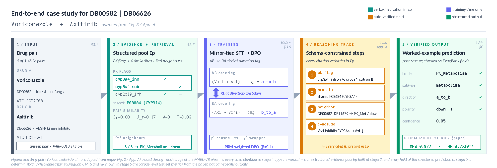
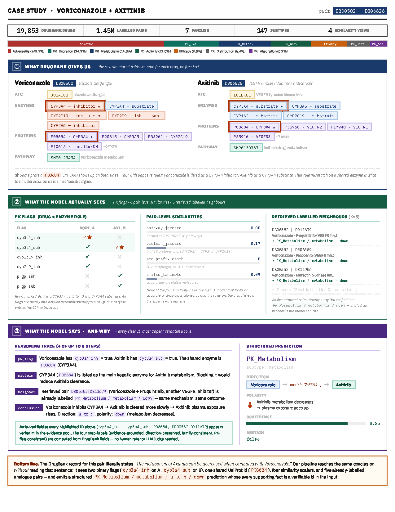

# MARD: Mirror-Augmented Reasoning Distillation for Mechanism-Level Drug–Drug Interaction Prediction

Research code accompanying our EMNLP 2026 submission.

## Abstract

Mechanism-level drug–drug interaction (DDI) prediction requires
identifying *which* enzyme or pharmacodynamic axis is implicated, in
*which* direction, and with *which* evidence — not merely whether two
drugs interact. We introduce a reproducible mechanism-level DDI
labelling and evaluation protocol with a structured 7-family / 147-subtype
taxonomy, leakage-safe cold-split protocols, and auditable reasoning
metrics for evaluating pharmacological prediction beyond flat
interaction classification. We propose a pipeline that produces a 7B
reasoning **MARD** (**M**irror-**A**ugmented **R**easoning
**D**istillation), combining three training innovations: a
single-token KL on the direction tag that ties the model's prediction,
per-loss PRM-weighted DPO with programmatic hard negatives, and a
leakage-safe mechanism-aware retrieval channel. Process-reward step
labels are automatically verifiable against DrugBank-structured
fields, requiring no human annotation or LLM judge. On the
April-2026 DrugBank release, our **MARD-7B** is the only system in a
32-system comparison whose accuracy survives drug-pair novelty,
beating the best baseline by **+13.9 pp** and GPT-4o by **+6.7 pp**
at ~1% of frontier API cost. Further analysis reveals an
*anti-memorisation* signature where accuracy improves on rarely seen
drugs, suggesting that gain comes from structured pharmacological
reasoning rather than drug-frequency memorisation.

## Pipeline overview

The pipeline produces a small, calibrated DDI predictor that emits
mechanism-grounded reasoning traces. At a high level it has four phases:

- **Phase A — Data construction.** A DrugBank-derived corpus, a curated
  7-family / multi-subtype label taxonomy with directionality, pair-level
  mechanistic signatures, and three reproducible train/val/test splits
  (random, drug-cold, pair-cold) plus a stratified development subset.
- **Phase B — Teacher generation and PRM training.** A heterogeneous
  three-teacher ensemble (Llama-3.3-70B, Qwen2.5-72B,
  DeepSeek-R1-Distill-Llama-70B) produces step-structured reasoning
  traces. A Process Reward Model is then trained on auto-verifiable
  step-level signals (evidence grounding, direction preservation, family
  consistency, PK-flag consistency, and others) to filter and re-rank
  candidate traces.
- **Phase C — Student training.** A 7B student is fine-tuned on the
  PRM-filtered teacher traces with a faithfulness loss and a mirror-pair
  symmetry-KL term, followed by preference optimization on hard-negative
  and direction-mirror pairs.
- **Phase D — Evaluation.** Standard classification metrics together
  with the novel reasoning-faithfulness metrics introduced in this work,
  conformal abstention, verifier re-ranking, and head-to-head
  comparisons against frontier LLMs and DDI-specific baselines.

This repository is the source code, configuration, and example launchers
that produced the results in the paper.

## End-to-end case study for pair DB00582 | DB06626 (Voriconazole + Axitinib)

A concrete illustration of what MARD-7B does on a single DrugBank
pair. Both panels are discussed in the paper (Fig.&nbsp;3 /
Appendix&nbsp;A); they are reproduced here so the
input → reasoning → verifiable-output flow is visible without
opening the PDF.

### Pipeline at a glance

The five-stage view from the structured input pool, through the
mirror-tied SFT and PRM-weighted DPO objectives, to the
schema-constrained reasoning trace and verified final answer:

<p align="center">
  
</p>

### What the model actually reads and emits

A drill-down on the same pair: the raw DrugBank fields, the
PK-flag table and pair-level similarity scalars the model receives,
the five retrieved labelled neighbours, the four-step reasoning
trace, and the structured prediction
(`PK_Metabolism / metabolism / a_to_b / down`, confidence 0.85).
Every cited identifier appears verbatim in the evidence pool, so
each step is independently checkable against DrugBank without any
LLM judge in the loop:

<p align="center">
  
</p>

## Repository Layout

```
EMNLP2026_DDI_Verifier_Release/
├── configs/                  # YAML configs (base + PRM rubric + FSDP)
├── docs/
│   ├── figures/              # Case-study figures used in README
│   ├── PIPELINE_OVERVIEW.md  # End-to-end pipeline reference
│   └── REPRODUCIBILITY.md    # Hashes, configs, seed protocol
├── notebooks/                # Optional analysis notebooks
├── scripts/
│   ├── cluster_examples/     # Example portable SLURM launchers
│   └── examples/             # Example local commands
├── src/
│   ├── audit/                # Data-integrity audits
│   ├── data/                 # Corpus construction + split builders
│   ├── teacher/              # Teacher generation, PRM, critic, judges
│   ├── training/             # SFT + DPO + sweep tooling
│   ├── inference/            # Predict + verifier re-rank + abstention
│   ├── evaluation/           # Eval harness + bootstrap CIs + analyses
│   ├── metrics/              # Novel + standard metrics
│   └── visualization/        # Figure / table generation
├── tests/                    # Unit tests
├── requirements.txt
├── LICENSE
└── README.md
```

## Installation

```bash
git clone <repository-url> EMNLP2026_DDI_Verifier_Release
cd EMNLP2026_DDI_Verifier_Release
python -m venv .venv
source .venv/bin/activate
pip install --upgrade pip
pip install -r requirements.txt
python -m spacy download en_core_web_sm
export PYTHONPATH="$PWD:$PYTHONPATH"
```

For GPU clusters, portable example launchers live under
`scripts/cluster_examples/`. They target a typical 4 x H100 80GB node
and read `--account`, venv path, and module names from environment
variables (see `scripts/cluster_examples/setup_env.sh` and
`scripts/cluster_examples/activate_env.sh`).

## Environment Variables

| Variable             | Purpose                                                  |
| -------------------- | -------------------------------------------------------- |
| `DDI_ROOT`           | Repository root (defaults to `.`)                        |
| `DDI_OUTPUTS`        | Output directory for predictions and eval artifacts      |
| `DDI_CKPT`           | Checkpoint directory for student and PRM adapters        |
| `OPENAI_API_KEY`     | Required for `--provider openai` frontier evaluations    |
| `ANTHROPIC_API_KEY`  | Required for `--provider anthropic` judges               |
| `GOOGLE_API_KEY`     | Required for `--provider google` (Gemini) judges         |

## Data

The pipeline operates on a fixed DrugBank XML release (the exact version
is recorded in `configs/base.yaml -> data_sources.drugbank`) together
with DDInter severity metadata (used only as metadata, never as a
prediction target) and KEGG / SMPDB pathway maps.

Raw redistributable data is **not** included here. After obtaining
DrugBank (license required) and the pathway dumps, the data-construction
modules in `src/data/` reconstruct the canonical processed parquets and
JSONL splits. The exact file paths, expected counts, and SHA-256 hashes
are pinned in `configs/base.yaml`.

## Evaluation

Headline numbers are produced by `src.evaluation.run_full_eval`, which
takes a predictions JSONL plus a ground-truth manifest and writes the
full metrics table together with bootstrap confidence intervals to
`outputs/results/<run_name>/`.

```bash
python -m src.evaluation.run_full_eval \
    --predictions outputs/predictions/student_rerank.jsonl \
    --labels      data_processed/labels_hierarchical.parquet \
    --split       random_full \
    --run_name    student_rerank
```

Frontier-LLM comparison runs (GPT-4o, Claude Opus 4, Gemini 2.5 Pro) are
launched through `scripts/examples/run_frontier_chain.sh`, which records
the exact API model id and request parameters next to the predictions.

## Metrics

Beyond macro-F1 and accuracy, we report the following metrics
(implemented in `src/metrics/` and re-exported by
`src/metrics/__init__.py`):

| Metric | Meaning                                                      |
| ------ | ------------------------------------------------------------ |
| MFS    | Mechanism-Faithfulness Score (rationale vs. mechanism)       |
| MPS    | Mirror-Pair Separation (direction-symmetry awareness)        |
| CFS    | Counterfactual-Faithfulness Score                            |
| RPC    | Reasoning-Prediction Coherence (rationale vs. final answer)  |
| THS    | Taxonomy-Hierarchy Score                                     |
| CSA    | Compositional-Subtype Accuracy                               |
| HR     | Hallucination Rate (rationale entities outside DrugBank)     |
| AU     | Abstention Utility (selective coverage / accuracy)           |
| SLFS   | Selective-Label Faithfulness Score                           |
| MOR    | Mechanism-Overlap Ratio (retrieval audit, optional)          |

Bootstrap confidence intervals and paired significance tests are in
`src/evaluation/bootstrap_ci.py` and
`src/evaluation/paired_bootstrap_significance.py`.

## Tests

```bash
pytest -q
```

Unit tests cover the metrics library, conformal abstention, preference
pair construction, and the evaluation harness adapters.

## License

The **code** in this repository is released under the
[MIT License](LICENSE).

The **released LoRA adapters** (MARD-7B SFT and PRM-DPO checkpoints,
PRM scorer) and **curated derivative corpora** (mirror-augmented SFT
splits, preference pairs, evaluation manifests) will be released
under [CC BY-NC 4.0][cc-by-nc] for non-commercial research use, in
compliance with [DrugBank][drugbank]'s academic-licence terms.

The underlying **raw datasets** ([DrugBank][drugbank] XML, DDInter
severity table, KEGG / SMPDB pathway dumps) are **not** redistributed
here: each carries its own upstream licence and must be obtained
directly from the source. The pipeline reconstructs the canonical
processed files locally from a licensed [DrugBank][drugbank] release
plus the pathway dumps; the expected file paths and SHA-256 hashes
are pinned in `configs/base.yaml`.

This is **research code released for academic / non-commercial use
only**. The released MARD-7B adapters are not a medical device, not
a clinical decision-support system, and must not be used as the sole
basis for any prescribing or de-prescribing decision; every
deployment must keep a qualified pharmacist or physician in the loop
and treat each model output as a hypothesis subject to independent
verification against primary clinical references.

[cc-by-nc]: https://creativecommons.org/licenses/by-nc/4.0/
[drugbank]: https://go.drugbank.com/

## Acknowledgments

We thank the maintainers of the open-source projects this work builds
upon, including [Med-PRM][med-prm], HuggingFace
[Transformers][hf-transformers] / [Accelerate][hf-accelerate] /
[PEFT][hf-peft] / [TRL][hf-trl], [vLLM][vllm], and the OpenDDI
baselines repository.

[med-prm]: https://github.com/dmis-lab/Med-PRM
[hf-transformers]: https://github.com/huggingface/transformers
[hf-accelerate]: https://github.com/huggingface/accelerate
[hf-peft]: https://github.com/huggingface/peft
[hf-trl]: https://github.com/huggingface/trl
[vllm]: https://github.com/vllm-project/vllm
